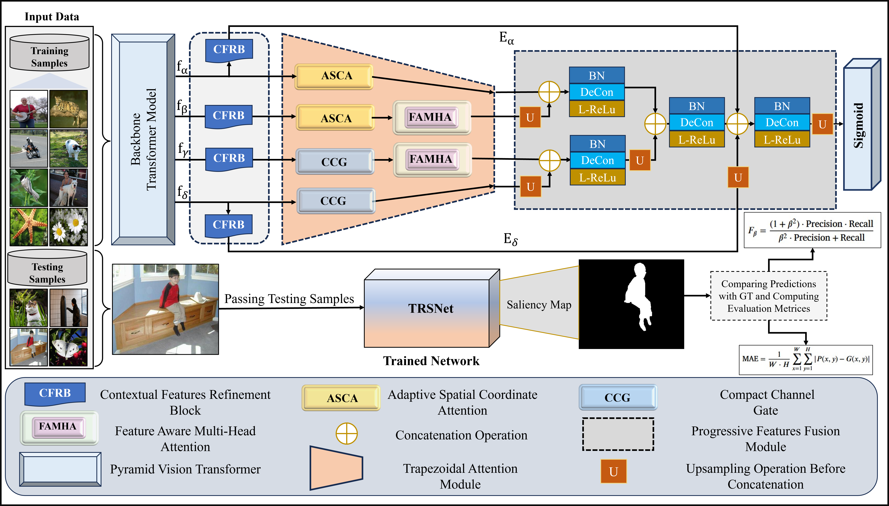

# TRSNet: Lightweight Transformer-Driven Multi-Scale Trapezoidal Attention Network for Efficient Saliency Detection

This repository contains the official PyTorch implementation of **TRSNet**, a lightweight saliency detection model that leverages transformer-driven multi-scale trapezoidal attention mechanisms for accurate and efficient salient object detection.

## 🔍 Highlights
- **The proposed network balances efficiency and performance via a lightweight design.
- **CFRBs with dilated convolutions enhance multi-scale contextual representations.
- **The introduced TAM effectively refines features by integrating ASCA and CCG.
- **FAMHA blocks capture long-range dependencies and global cues.
- **TRSNet outperforms SOTA methods across six saliency detection benchmarks.

## Network Architecture
Visuall illustration of TRSNet


## 📄 Paper
*Coming soon...*

## 🖼️ Saliency Maps
Saliency maps generated by TRSNet on various benchmark datasets are publicly available:

📌 [Download Saliency Maps](https://drive.google.com/file/d/1kYy_5TPy5ao1DBRtwXGTQs3PagDOeJts/view?usp=sharing)


## 📝 Citation
Please cite our below published studies
```bibtex
@article{talha2025trsnet,
  title={Lightweight transformer-driven multi-scale trapezoidal attention network for saliency detection},
  author={Usman, Muhammad Talha and Khan, Habib and Rida, Imad Talha and Koo, JaKeoung},
  journal={Engineering Applications of Artificial Intelligence},
  pages={},
  year={2025},
  publisher={Elsevier}
}
```

